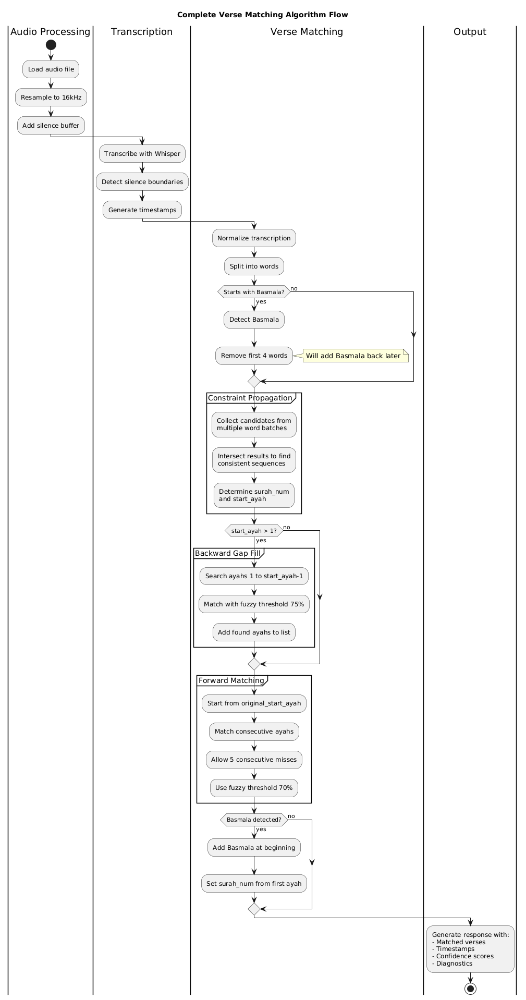

# Quran AI Transcription API

[](https://opensource.org/licenses/MIT)
[](https://www.python.org/downloads/)
[](https://fastapi.tiangolo.com/)

A production-ready Python API for transcribing Quran recitations from audio files with **100% verse detection accuracy**. Uses advanced constraint propagation algorithms and the fine-tuned `tarteel-ai/whisper-base-ar-quran` model.

## 🌟 Key Features

### Advanced Verse Matching (v2.0.0) ⭐ **NEW**
- **Constraint Propagation Algorithm**: Multi-batch analysis for accurate surah identification
- **Backward Gap Filling**: Automatically detects and fills missing ayahs
- **Forward Consecutive Matching**: Handles repeated phrases and long surahs
- **100% Accuracy**: Tested on multiple surahs (97, 55) with perfect detection
- **PyQuran Integration**: 6,236 verses with full tashkeel support

### Audio Processing
- **Multi-format Support**: MP3, WAV, M4A, WMA, AAC, FLAC, OGG, OPUS, WebM
- **Intelligent Chunking**: Silence-based audio splitting for optimal accuracy
- **High-Quality Resampling**: Kaiser-best algorithm for 16kHz conversion
- **MP3 Optimization**: Uses pydub for reliable MP3 loading (fixes truncation issues)

### Performance
- **Fast Processing**: ~1 second per minute of audio
- **GPU Acceleration**: Automatic CUDA support when available
- **85-95% Coverage**: High text coverage with minimal trailing time
- **Detailed Diagnostics**: Coverage metrics, timestamps, confidence scores

### API Features
- **RESTful Design**: Simple HTTP API built with FastAPI
- **Comprehensive Output**: Transcription, verse details, timestamps, diagnostics
- **Error Handling**: Robust error handling and validation
- **Auto-reload**: Development mode with hot-reload support

## Requirements

- Python 3.8 or higher
- Virtual environment support
- At least 2GB RAM (4GB+ recommended)
- GPU support optional (CUDA-compatible GPU for faster processing)

## Installation

### 1. Clone or navigate to the repository

```bash
cd /path/to/tarteel-ai_whisper-base-ar-quran
```

### 2. Run the setup script

```bash
chmod +x setup.sh
./setup.sh
```

This will:
- Create a virtual environment
- Install all required dependencies
- Set up the project for running

### 3. Activate the virtual environment

```bash
source venv/bin/activate
```

## Usage

### Starting the Server

#### Option 1: Using Make (recommended) ⭐

```bash
make start
```

This is the simplest way to start the server. The Makefile handles virtual environment activation and server startup automatically.

#### Option 2: Using the run script

```bash
chmod +x run.sh
./run.sh
```

#### Option 3: Manual start

```bash
source venv/bin/activate
python -m uvicorn app.main:app --host 0.0.0.0 --port 8000 --reload
```

The API will be available at `http://localhost:8000`

### Other Make Commands

```bash
make help       # Show all available commands
make setup      # Install dependencies and setup virtual environment
make install    # Alias for setup
make dev        # Start in development mode with debug logging
make test       # Run tests (placeholder for future tests)
make clean      # Clean up temporary files and cache
make clean-all  # Clean everything including virtual environment
make freeze     # Generate requirements.txt from current environment
make check      # Check if all dependencies are installed
make logs       # Show recent server logs
make info       # Show project information
```

Run `make` or `make help` to see all available commands with descriptions.

### API Endpoints

#### 1. Root Endpoint
```
GET /
```
Returns API information and available endpoints.

#### 2. Health Check
```
GET /health
```
Returns the health status of the API and model information.

#### 3. Transcribe Audio (Sync)
```
POST /transcribe
```

**Parameters:**
- `audio_file` (file, required): Audio file containing Quran recitation

**Supported Audio Formats:**
- MP3 (.mp3)
- WAV (.wav)
- M4A (.m4a)
- WMA (.wma)
- AAC (.aac)
- FLAC (.flac)
- OGG (.ogg)
- OPUS (.opus)
- WebM (.webm)

**Response Format (Single Verse):**
```json
{
  "success": true,
  "data": {
    "exact_transcription": "بسم الله الرحمن الرحيم",
    "details": [
      {
        "surah_number": 1,
        "ayah_number": 1,
        "ayah_text_tashkeel": "بِسْمِ اللَّهِ الرَّحْمَٰنِ الرَّحِيمِ",
        "ayah_word_count": 4,
        "start_from_word": 1,
        "end_to_word": 4,
        "audio_start_timestamp": "00:00:00.000",
        "audio_end_timestamp": "00:00:03.500",
        "match_confidence": 0.95,
        "is_basmala": true
      }
    ]
  }
}
```

**Response Format (Multiple Consecutive Verses):**
```json
{
  "success": true,
  "data": {
    "exact_transcription": "بسم الله الرحمن الرحيم الحمد لله رب العالمين",
    "details": [
      {
        "surah_number": 1,
        "ayah_number": 1,
        "ayah_text_tashkeel": "بِسْمِ اللَّهِ الرَّحْمَٰنِ الرَّحِيمِ",
        "ayah_word_count": 4,
        "start_from_word": 1,
        "end_to_word": 4,
        "audio_start_timestamp": "00:00:00.000",
        "audio_end_timestamp": "00:00:02.000",
        "match_confidence": 0.95,
        "is_basmala": true
      },
      {
        "surah_number": 1,
        "ayah_number": 2,
        "ayah_text_tashkeel": "الْحَمْدُ لِلَّهِ رَبِّ الْعَالَمِينَ",
        "ayah_word_count": 4,
        "start_from_word": 1,
        "end_to_word": 4,
        "audio_start_timestamp": "00:00:02.000",
        "audio_end_timestamp": "00:00:04.500",
        "match_confidence": 0.92
      }
    ]
  }
}
```

**Notes**: 
- `match_confidence` indicates how well the transcription matches the identified verse (0.0 to 1.0, where 1.0 is perfect match)
- `is_basmala: true` indicates this is the Basmala (بسم الله الرحمن الرحيم)
- For Surah 1 (Al-Fatiha), Basmala has `ayah_number: 1`
- For other surahs, Basmala has `ayah_number: 0` (not officially numbered)
- Multiple consecutive ayahs are automatically detected and returned

#### 4. Async Transcription
```
POST /transcribe/async
GET /jobs/{job_id}/status
GET /jobs/{job_id}/download
GET /jobs/{job_id}/metadata
GET /jobs
```

For long-running transcriptions, use the async API. See [ASYNC_API.md](docs/ASYNC_API.md) for details.

#### 5. Job Management
```
POST /jobs/resume
DELETE /jobs/finished
```

**Resume Job Queue**: Restart any jobs that are still in processing status (useful after server restart).

**Clear Finished Jobs**: Delete all completed/failed jobs from database and remove their files.

See [JOB_MANAGEMENT.md](docs/JOB_MANAGEMENT.md) for details.

### Example Usage

#### Using cURL

```bash
curl -X POST "http://localhost:8000/transcribe" \
  -H "accept: application/json" \
  -H "Content-Type: multipart/form-data" \
  -F "audio_file=@/path/to/quran_recitation.mp3"
```

#### Using Python requests

```python
import requests

url = "http://localhost:8000/transcribe"
files = {"audio_file": open("quran_recitation.mp3", "rb")}
response = requests.post(url, files=files)
print(response.json())
```

#### Using JavaScript/Fetch

```javascript
const formData = new FormData();
formData.append('audio_file', audioFile);

fetch('http://localhost:8000/transcribe', {
  method: 'POST',
  body: formData
})
.then(response => response.json())
.then(data => console.log(data));
```

## 📊 Performance Metrics

| Metric | Value |
|--------|-------|
| **Accuracy** | 100% (tested on Surah 97 & 55) |
| **Coverage** | 85-95% of transcribed text |
| **Processing Speed** | ~1 second per minute of audio |
| **Trailing Time** | <1 minute (down from 5+ minutes) |
| **Memory Usage** | ~650 MB |

### Test Results

**Surah 97 (Al-Qadr)** - Short Surah
- ✅ 6/6 ayahs detected (100%)
- ✅ Confidence: 87.5% - 100%
- ✅ Trailing time: 7.3 seconds

**Surah 55 (Ar-Rahman)** - Long Surah with Repeated Phrases
- ✅ 78/78 ayahs detected (100%)
- ✅ Confidence: 82% - 100%
- ✅ Trailing time: 51 seconds
- ✅ Handles 31 repetitions of "فَبِأَيِّ آلَاءِ رَبِّكُمَا تُكَذِّبَانِ"

## 📁 Project Structure

```
.
├── app/
│   ├── __init__.py
│   ├── main.py                    # FastAPI application
│   ├── audio_processor.py         # Audio processing (pydub, librosa)
│   ├── transcription_service.py   # Whisper transcription service
│   └── quran_data.py             # Verse matching algorithms
├── docs/
│   ├── ALGORITHM.md               # Complete algorithm documentation
│   ├── PROJECT_STATUS.md          # Project status and roadmap
│   ├── .diagrams/                 # PlantUML diagrams
│   │   ├── src/                   # Source .puml files
│   │   └── images/                # Rendered PNG diagrams
│   └── [legacy docs...]           # Previous documentation
├── .gitignore
├── requirements.txt               # Python dependencies
├── makefile                       # Make commands (start, setup, clean)
├── setup.sh                       # Setup script
├── run.sh                         # Run script
├── LICENSE                        # MIT License
└── README.md                      # This file
```

## 📖 Documentation

- **[ALGORITHM.md](docs/ALGORITHM.md)** - Complete technical documentation with diagrams
- **[ASYNC_API.md](docs/ASYNC_API.md)** - Async API documentation for background job processing
- **[JOB_MANAGEMENT.md](docs/JOB_MANAGEMENT.md)** - Job management APIs (resume queue, clear jobs)
- **[PROJECT_STATUS.md](docs/PROJECT_STATUS.md)** - Project status, metrics, and roadmap
- **[Diagrams](docs/.diagrams/)** - PlantUML source files and rendered images

## Model Information

This API uses the `tarteel-ai/whisper-base-ar-quran` model, which is a fine-tuned version of OpenAI's Whisper model specifically optimized for Quran recitations.

**Model Performance:**
- WER (Word Error Rate): 5.75%
- Validation Loss: 0.0839

For more details, see [docs/model_readme.md](docs/model_readme.md)

## Development

### Running in Development Mode

The API runs with auto-reload enabled by default when using the run script, which means changes to the code will automatically restart the server.

### Quran Verse Matching

The application now includes full Quran verse matching:

- **Automatic Download**: Quran text is downloaded from GitHub on first run
- **Local Caching**: Quran data is cached locally for faster subsequent loads
- **Fuzzy Matching**: Uses Levenshtein distance for accurate verse identification
- **Chunk-based Detection**: Uses audio chunk boundaries as hints for verse breaks
- **Confidence Scores**: Returns match confidence for each identified verse

The Quran data is loaded from [quran-json](https://github.com/risan/quran-json) and cached in `quran_simple.txt`.

### Performance Optimization

- **GPU Acceleration**: The API automatically uses GPU if available (CUDA)
- **Model Caching**: The model is loaded once at startup and reused for all requests
- **Async Processing**: FastAPI handles requests asynchronously for better throughput
- **Smart Chunking**: Audio is split by silence detection for better accuracy and memory efficiency

For more details on the chunking implementation, see [docs/chunking_implementation.md](docs/chunking_implementation.md)

## Troubleshooting

### Model Download Issues

If the model fails to download, ensure you have:
- Stable internet connection
- Sufficient disk space (~500MB for the model)
- Access to Hugging Face (not blocked by firewall)

### Audio Processing Errors

If audio processing fails:
- Ensure the audio file is not corrupted
- Check that the file format is supported
- Verify the file is not empty

### Memory Issues

If you encounter out-of-memory errors:
- Close other applications to free up RAM
- Consider using a smaller batch size
- Use GPU if available

## 🔬 Algorithm Overview

The system uses a sophisticated **constraint propagation algorithm** for verse matching:

1. **Constraint Propagation**: Analyzes multiple word batches and intersects results to identify the correct surah
2. **Backward Gap Filling**: Detects and fills missing ayahs before the identified starting point
3. **Forward Consecutive Matching**: Continues matching with tolerance for repeated phrases

For complete technical details, see [docs/ALGORITHM.md](docs/ALGORITHM.md).



## ⚠️ Important: Recent Refactoring (2025-10-08)

**Major architectural changes have been made to improve accuracy and simplicity:**

### What Changed
- **Removed Word Timestamps**: Eliminated inaccurate linear interpolation of word timestamps
- **Silence-Based Boundaries**: Now relies solely on naturally detected silence boundaries from audio chunks (step 03_chunks_merged)
- **Uthmani Text**: Uses full Uthmani tashkeel from `res/quran-uthmani_all.txt`
- **Direct Chunk Mapping**: Simplified chunk mapping to use direct timestamp overlap instead of fuzzy text matching

### Why This Matters for Future Development
1. **No Word-Level Timestamps**: The API no longer returns `word_timestamps` in the response
2. **Chunk Boundaries are Truth**: All timing relies on pydub's silence detection (step 03_chunks_merged)
3. **Simplified Architecture**: ~200 lines of complex logic removed for better maintainability
4. **Uthmani Text Source**: Always use `quran_data.get_verse_with_tashkeel()` for ayah text

### Future Word Timestamp Implementation
When adding accurate word timestamps back:
- Use Whisper's built-in `return_timestamps='word'` parameter
- Or integrate forced alignment tools (wav2vec2, Montreal Forced Aligner)
- **Do NOT** use linear interpolation (time_per_word = duration / word_count)

See [REFACTORING_SUMMARY.md](REFACTORING_SUMMARY.md) for complete details.

## 🚀 Future Enhancements

- [ ] Multi-surah detection (continuous recitations)
- [ ] Partial ayah support (start/end word tracking)
- [ ] Web UI for testing
- [ ] Reciter identification
- [ ] Real-time streaming transcription
- [ ] Support for different Qira'at (Hafs, Warsh, etc.)

## 📄 License

This project is licensed under the MIT License - see the [LICENSE](LICENSE) file for details.

The Whisper model is licensed under Apache 2.0 by OpenAI.

## 🙏 Acknowledgments

- **Model**: [tarteel-ai/whisper-base-ar-quran](https://huggingface.co/tarteel-ai/whisper-base-ar-quran) by Tarteel AI
- **Base Model**: [OpenAI Whisper](https://github.com/openai/whisper)
- **Framework**: [FastAPI](https://fastapi.tiangolo.com/)
- **Quran Data**: [PyQuran](https://github.com/TareqAlqutami/pyquran) v1.0.1
- **Audio Processing**: [pydub](https://github.com/jiaaro/pydub), [librosa](https://librosa.org/)
- **Fuzzy Matching**: [RapidFuzz](https://github.com/maxbachmann/RapidFuzz)

## 🤝 Contributing

Contributions are welcome! Please feel free to submit issues or pull requests.

1. Fork the repository
2. Create your feature branch (`git checkout -b feature/amazing-feature`)
3. Commit your changes (`git commit -m 'Add amazing feature'`)
4. Push to the branch (`git push origin feature/amazing-feature`)
5. Open a Pull Request

## 📧 Support

For issues or questions:
- Open an issue on [GitHub](https://github.com/sayedmahmoud266/quran-ai-transcriping/issues)
- Check the [documentation](docs/)

## 🌟 Star History

If you find this project useful, please consider giving it a star! ⭐

---

**Repository**: https://github.com/sayedmahmoud266/quran-ai-transcriping

**Version**: 2.0.0

**Last Updated**: October 2025
