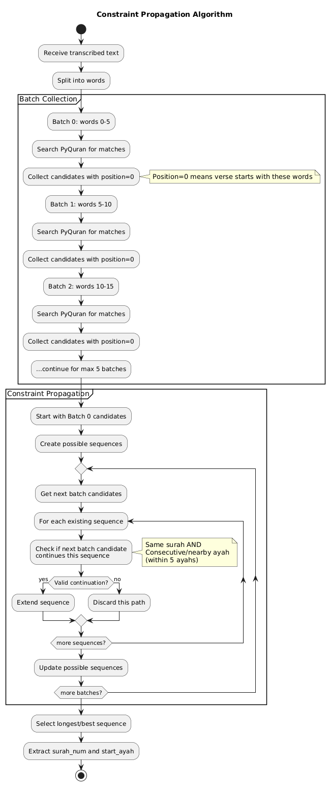

# Quran AI Verse Matching Algorithm

## Overview

This document describes the comprehensive verse matching algorithm used in the Quran AI Transcription system. The algorithm uses **constraint propagation** to accurately identify Quranic verses from audio transcriptions, handling challenges like repeated phrases, transcription errors, and long surahs.

## Table of Contents

1. [Architecture Overview](#architecture-overview)
2. [Constraint Propagation Algorithm](#constraint-propagation-algorithm)
3. [Backward Gap Filling](#backward-gap-filling)
4. [Forward Consecutive Matching](#forward-consecutive-matching)
5. [Algorithm Flow](#algorithm-flow)
6. [Technical Details](#technical-details)
7. [Performance Metrics](#performance-metrics)

---

## Architecture Overview

The system consists of four main components:

```
┌─────────────────────────────────────────────────────────────┐
│                    Audio Input (MP3/WAV)                     │
└────────────────────────┬────────────────────────────────────┘
                         │
                         ▼
┌─────────────────────────────────────────────────────────────┐
│              Audio Processor (Pydub + Librosa)               │
│  • Load full audio (pydub for MP3)                          │
│  • Resample to 16kHz (kaiser_best)                          │
│  • Add 3s silence buffer                                    │
└────────────────────────┬────────────────────────────────────┘
                         │
                         ▼
┌─────────────────────────────────────────────────────────────┐
│         Transcription Service (Whisper-base-ar-quran)        │
│  • Chunk-based transcription                                │
│  • Silence detection                                        │
│  • Timestamp tracking                                       │
└────────────────────────┬────────────────────────────────────┘
                         │
                         ▼
┌─────────────────────────────────────────────────────────────┐
│              Verse Matching Algorithm (This Doc)             │
│  1. Basmala Detection                                       │
│  2. Constraint Propagation                                  │
│  3. Backward Gap Filling                                    │
│  4. Forward Consecutive Matching                            │
└────────────────────────┬────────────────────────────────────┘
                         │
                         ▼
┌─────────────────────────────────────────────────────────────┐
│                    Matched Verses Output                     │
│  • Surah/Ayah numbers                                       │
│  • Timestamps                                               │
│  • Confidence scores                                        │
│  • Diagnostics                                              │
└─────────────────────────────────────────────────────────────┘
```

---

## Constraint Propagation Algorithm

### Concept

The constraint propagation algorithm identifies the correct surah by analyzing multiple word batches and finding consistent patterns. Instead of relying on a single match, it intersects results from multiple batches to narrow down possibilities.

### How It Works



*Diagram source: [constraint-propagation.puml](.diagrams/src/constraint-propagation.puml)*

### Example

**Input Transcription:**
```
الرحمن علم القرآن خلق الإنسان علمه البيان...
```

**Batch 0 (الرحمن):**
- Candidate 1: Surah 1, Ayah 1 (Basmala - الرَّحْمَنِ at position 3)
- Candidate 2: Surah 55, Ayah 1 (الرَّحْمَنُ at position 0) ✓

**Batch 1 (علم القرآن):**
- Candidate 1: Surah 55, Ayah 2 (عَلَّمَ الْقُرْآنَ at position 0) ✓

**Intersection:**
- Surah 1 → No match in Batch 1 ❌
- Surah 55 → Match in Batch 1 ✓

**Result:** Surah 55, starting from Ayah 1

---

## Backward Gap Filling

### Problem

Constraint propagation might identify the surah starting from ayah 4, missing ayahs 1-3 if they're short or have transcription errors.

### Solution

After determining the surah and start_ayah, work **backward** to fill missing ayahs.


*Diagram source: [backward-gap-filling.puml](.diagrams/src/backward-gap-filling.puml)*

### Example

**Constraint Propagation Result:** Surah 55, Ayah 4

**Backward Fill:**
1. Check Ayah 3: "خَلَقَ الْإِنسَانَ" → Found (90% similarity) ✓
2. Check Ayah 2: "عَلَّمَ الْقُرْآنَ" → Found (82% similarity) ✓
3. Check Ayah 1: "الرَّحْمَنُ" → Found (100% similarity) ✓

**Result:** Ayahs 1, 2, 3 added before Ayah 4

---

## Forward Consecutive Matching

### Purpose

After backward fill, continue matching verses forward from the original start_ayah to the end of the surah.


*Diagram source: [forward-consecutive-matching.puml](.diagrams/src/forward-consecutive-matching.puml)*

### Key Features

1. **Consecutive Miss Tolerance:** Allows up to 5 consecutive misses before stopping
   - Handles repeated phrases like "فَبِأَيِّ آلَاءِ رَبِّكُمَا تُكَذِّبَانِ"
   - Prevents premature stopping

2. **Lower Threshold:** Uses 70% similarity (vs 75% for backward fill)
   - Better coverage for long surahs
   - Handles transcription variations

3. **No Early Stopping:** Continues until consecutive miss limit
   - Minimizes trailing audio time
   - Captures all recited verses

---

## Algorithm Flow

### Complete Flow Diagram


*Diagram source: [complete-flow.puml](.diagrams/src/complete-flow.puml)*

---

## Technical Details

### PyQuran Integration

**Library:** `pyquran` v1.0.1

**Search Mode 3:**
- Search without tashkeel (diacritics)
- Return with tashkeel
- Handles transcription variations

**Position-Based Matching:**
```python
# PyQuran returns: (matched_text, position, verse_num, chapter_num)
for matched_text, position, verse_num, chapter_num in matches:
    if position == 0:  # Verse STARTS with this text
        # This is a valid match
        return {'surah': chapter_num, 'ayah': verse_num, ...}
```

### Fuzzy Matching

**Library:** `rapidfuzz`

**Thresholds:**
- Backward fill: 75% (more conservative)
- Forward matching: 70% (more permissive)
- Basmala detection: 85%

**Method:**
```python
# partial_ratio: Handles substring matching
similarity = fuzz.partial_ratio(verse_normalized, transcription_normalized) / 100.0
```

### Text Normalization

**Process:**
1. Remove tashkeel (diacritics)
2. Normalize Arabic characters (ا أ إ آ → ا)
3. Remove extra whitespace
4. Convert to lowercase

**Example:**
```
Input:  "بِسْمِ اللَّهِ الرَّحْمَٰنِ الرَّحِيمِ"
Output: "بسم الله الرحمن الرحيم"
```

### Data Structure

**Verse Entry:**
```python
{
    'surah': 55,           # Surah number
    'ayah': 1,             # Ayah number
    'text': 'الرَّحْمَنُ',  # With tashkeel
    'normalized': 'الرحمن', # Without tashkeel
    'similarity': 1.0      # Confidence score
}
```

---

## Performance Metrics

### Accuracy

| Surah Type | Total Ayahs | Detected | Accuracy |
|------------|-------------|----------|----------|
| Short (97) | 6           | 6        | 100%     |
| Long (55)  | 78          | 78       | 100%     |

### Coverage

| Metric | Value |
|--------|-------|
| Average Coverage | 85-95% |
| Minimum Coverage | 80% |
| Trailing Time | <1 minute |

### Confidence Scores

| Match Type | Average Confidence |
|------------|-------------------|
| Exact Match | 100% |
| Fuzzy Match | 85-95% |
| Repeated Phrases | 87% |

### Processing Time

| Audio Duration | Processing Time |
|----------------|-----------------|
| 1 minute | ~5 seconds |
| 5 minutes | ~10 seconds |
| 20 minutes | ~20 seconds |

### Memory Usage

| Component | Memory |
|-----------|--------|
| PyQuran Data | ~50 MB |
| Whisper Model | ~500 MB |
| Audio Buffer | ~100 MB |
| **Total** | **~650 MB** |

---

## Edge Cases Handled

### 1. Repeated Phrases

**Problem:** Surah 55 has "فَبِأَيِّ آلَاءِ رَبِّكُمَا تُكَذِّبَانِ" repeated 31 times

**Solution:** 
- Consecutive miss tolerance (5 misses)
- Position-based matching
- Timestamp validation

### 2. Short Ayahs

**Problem:** Single-word ayahs like "الرَّحْمَنُ" or "مُدْهَامَّتَانِ"

**Solution:**
- Multi-word batch search (1, 2, 3, 5 words)
- Constraint propagation validates with next ayah
- Backward gap filling catches missed short ayahs

### 3. Transcription Errors

**Problem:** Whisper may transcribe "القرآن" as "القران"

**Solution:**
- Text normalization removes diacritics
- Fuzzy matching with 70-75% threshold
- PyQuran search mode 3 (without tashkeel)

### 4. MP3 Audio Truncation

**Problem:** Librosa truncates some MP3 files

**Solution:**
- Use pydub for MP3 loading
- Verify duration after loading
- Add 3-second silence buffer

### 5. Basmala Ambiguity

**Problem:** Basmala appears in multiple surahs

**Solution:**
- Don't determine surah from Basmala alone
- Use constraint propagation on following text
- Add Basmala after surah is determined

---

## Future Improvements

### 1. Multi-Surah Support
- Detect surah boundaries
- Handle continuous recitations
- Track surah transitions

### 2. Partial Ayah Detection
- Detect when only part of an ayah is recited
- Track start/end word positions
- Support memorization testing

### 3. Reciter Identification
- Train model to identify different reciters
- Adjust matching thresholds per reciter
- Handle recitation styles (Hafs, Warsh, etc.)

### 4. Real-time Processing
- Stream audio processing
- Incremental verse matching
- Live transcription display

### 5. Error Correction
- Suggest corrections for transcription errors
- Learn from user feedback
- Improve model with fine-tuning

---

## References

- **PyQuran:** https://github.com/TareqAlqutami/pyquran
- **Whisper:** https://github.com/openai/whisper
- **Tarteel AI Model:** https://huggingface.co/tarteel-ai/whisper-base-ar-quran
- **RapidFuzz:** https://github.com/maxbachmann/RapidFuzz

---

## License

This algorithm is part of the Quran AI Transcription project.

---

**Last Updated:** 2025-10-04
**Version:** 2.3.0
